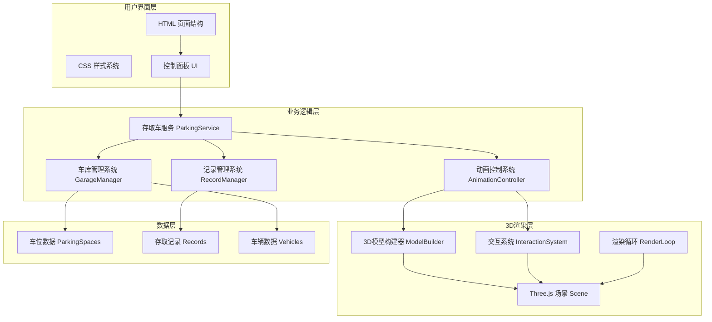
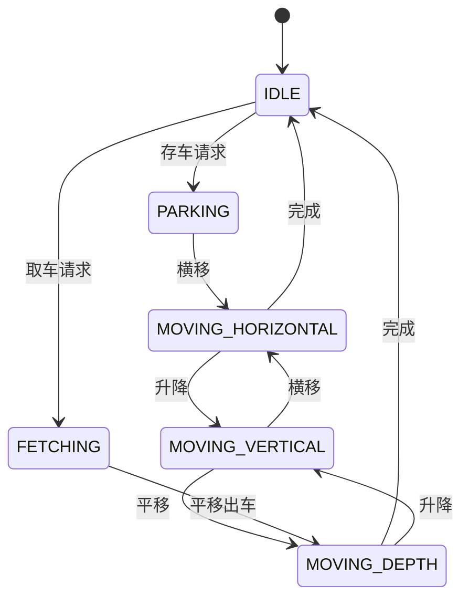

# 3D自动化立体车库模拟系统 - 技术架构文档

## 1. 技术选型

### 1.1 前端技术栈
| 技术 | 用途 | 版本 |
|------|------|------|
| Three.js | 3D图形渲染引擎 | r160+ |
| HTML5 | 页面结构 | - |
| CSS3 | 样式设计 | - |
| JavaScript (ES6+) | 业务逻辑 | - |
| OrbitControls | 3D视角控制 | Three.js内置 |

### 1.2 技术选择理由
- **Three.js**：成熟的WebGL封装库，提供完整的3D渲染能力，适合快速构建3D交互场景
- **纯前端方案**：无需后端服务，所有数据存储在浏览器内存中，部署简单
- **OrbitControls**：Three.js官方提供的相机控制器，支持旋转、缩放、平移操作

---

## 2. 系统架构

### 2.1 整体架构图


### 2.2 模块划分

#### 2.2.1 核心模块
1. **GarageManager** - 车库管理
   - 车位状态管理
   - 车辆信息管理
   - 故障状态管理

2. **AnimationController** - 动画控制
   - 存取车动画序列
   - 横移动画
   - 升降动画
   - 平移动画
   - 故障闪烁动画

3. **ParkingService** - 存取车服务
   - 存车逻辑
   - 取车逻辑
   - 车辆查找
   - 状态校验

4. **RecordManager** - 记录管理
   - 记录增删改查
   - 报表生成
   - 时间格式化

5. **ModelBuilder** - 3D模型构建
   - 车库结构建模
   - 车辆建模
   - 材质定义

6. **InteractionSystem** - 交互系统
   - 射线检测（Raycaster）
   - 车位点击处理
   - 高亮效果

---

## 3. 数据结构设计

### 3.1 车位数据 (ParkingSpace)
```javascript
{
  id: String,           // 车位编号 A1-A5, B1-B5, C1-C5
  floor: Number,        // 楼层 1-3
  position: Number,     // 位置 1-5
  status: Enum,         // 'free' | 'occupied' | 'fault'
  plateNumber: String,  // 车牌号
  parkTime: Date,       // 存入时间
  isFault: Boolean,     // 是否故障
  mesh: THREE.Mesh,     // 3D网格对象
  plateMesh: THREE.Mesh // 车牌网格
}
```

### 3.2 存取记录 (Record)
```javascript
{
  id: String,           // 记录ID
  plateNumber: String,  // 车牌号
  type: Enum,           // 'park' | 'fetch'
  spaceId: String,      // 车位编号
  time: Date,           // 操作时间
  description: String   // 描述
}
```

### 3.3 车辆数据 (Vehicle)
```javascript
{
  plateNumber: String,  // 车牌号
  mesh: THREE.Group,    // 车辆3D模型
  currentSpace: String, // 当前车位ID
  isMoving: Boolean     // 是否在移动中
}
```

---

## 4. 3D场景设计

### 4.1 场景坐标系统
- 坐标轴：Y轴向上，X轴水平，Z轴前后
- 车库中心位于原点 (0, 0, 0)
- 尺寸规格：
  - 车位宽度：3单位
  - 车位深度：6单位
  - 楼层高度：4单位
  - 出入口位置：Z = -10

### 4.2 3D模型组件
1. **车库主体**
   - 3层楼板
   - 支撑柱
   - 后墙和侧墙
   - 地面

2. **车位组件**
   - 停车位地面（带颜色指示）
   - 车位编号文字
   - 状态指示灯

3. **车辆模型**
   - 车身
   - 车轮
   - 车窗
   - 车牌

4. **传输机构**
   - 升降平台
   - 横移台车
   - 平移机构

### 4.3 光照系统
- 环境光 (AmbientLight)：0.4强度，白光
- 主平行光 (DirectionalLight)：0.8强度，45度角
- 辅助点光源 (PointLight)：车库内部照明

---

## 5. 动画系统设计

### 5.1 动画状态机


### 5.2 动画实现方案
- 使用 `requestAnimationFrame` 驱动渲染循环
- 动画插值使用 `THREE.MathUtils.lerp`
- 动画时间控制使用 `Clock.getDelta()`
- 动画队列使用 Promise 链式调用

### 5.3 故障闪烁动画
- 定时器控制材质颜色切换
- 红色/黄色交替闪烁
- 频率：每秒2次

---

## 6. 用户交互设计

### 6.1 3D场景交互
- **鼠标左键拖拽**：旋转视角
- **鼠标滚轮**：缩放视角
- **鼠标右键拖拽**：平移视角
- **车位点击**：选择空车位进行存车

### 6.2 控制面板交互
- 车牌号输入
- 取车按钮
- 搜索按钮
- 故障按钮（每个车位）

### 6.3 射线检测实现
```javascript
// 伪代码
const raycaster = new THREE.Raycaster();
const mouse = new THREE.Vector2();

function onMouseClick(event) {
  mouse.x = (event.clientX / window.innerWidth) * 2 - 1;
  mouse.y = -(event.clientY / window.innerHeight) * 2 + 1;
  raycaster.setFromCamera(mouse, camera);
  const intersects = raycaster.intersectObjects(parkingSpaceMeshes);
  if (intersects.length > 0) {
    handleSpaceClick(intersects[0].object);
  }
}
```

---

## 7. 项目文件结构

```
project/
├── index.html              # 主页面
├── css/
│   └── style.css           # 样式文件
├── js/
│   ├── config.js           # 配置文件
│   ├── GarageManager.js    # 车库管理
│   ├── AnimationController.js  # 动画控制
│   ├── ParkingService.js   # 存取车服务
│   ├── RecordManager.js    # 记录管理
│   ├── ModelBuilder.js     # 3D模型构建
│   ├── InteractionSystem.js # 交互系统
│   └── app.js              # 主应用入口
└── .trae/
    └── documents/
        ├── PRD.md
        └── Technical-Architecture.md
```

---

## 8. 关键算法

### 8.1 车辆查找算法
```javascript
function findVehicleByPlate(plateNumber) {
  return parkingSpaces.find(
    space => space.status === 'occupied' && 
             space.plateNumber === plateNumber
  );
}
```

### 8.2 动画路径计算
```javascript
// 取车路径：车位 -> 平移到通道 -> 升降到1层 -> 横移到出口 -> 平移到出入口
function calculateFetchPath(space) {
  const path = [];
  // 1. 平移到横移通道
  path.push({ type: 'depth', target: -space.position * 3 });
  // 2. 升降到1层
  path.push({ type: 'vertical', target: 0 });
  // 3. 横移到出口位置
  path.push({ type: 'horizontal', target: 0 });
  // 4. 平移到出入口
  path.push({ type: 'depth', target: -10 });
  return path;
}
```

### 8.3 车位编号生成
```javascript
function generateSpaceId(floor, position) {
  const floorLetter = String.fromCharCode(64 + floor); // A, B, C
  return `${floorLetter}${position}`;
}
```

---

## 9. 性能优化

### 9.1 3D性能优化
- 合并几何体 (BufferGeometryUtils.mergeBufferGeometries)
- 使用实例化渲染 (InstancedMesh) 处理重复模型
- 合理设置相机远裁剪面
- 禁用不必要的阴影计算

### 9.2 动画优化
- 使用 `THREE.Clock` 统一时间控制
- 动画插值使用增量时间
- 避免在动画循环中创建新对象

---

## 10. 部署方案

### 10.1 开发环境
- 使用本地HTTP服务器运行
- 推荐使用 `http-server` 或 `live-server`

### 10.2 生产环境
- 纯静态文件部署
- 支持任何静态文件服务器（Nginx、Apache等）
- Three.js通过CDN引入
